






# Welcome! 
I am now a PhD student at School of Computing in **National University of Singapore**. Fortunately, I will be supervised by Prof. Mong Li Lee and Prof. Wynne Hsu at Center for Trusted Internet and Community (CTIC). Prior to that, I received my master degree from **NUS** and bachelor degree from **Wuhan University**.

My research interest includes **Video Understanding, Video Generation, Multimodal Large Language Model.**

I am currently exploring new collaboration opportunities. If you are interested in any of the topics mentioned above, please feel free to reach out via **mluo@u.nus.edu**.

# 🔥 News
- **2025.05**: &nbsp;🎉 **Accepted at ACL 2025**  
  <u>Aristotle: Mastering Logical Reasoning with A Logic-Complete Decompose-Search-Resolve Framework</u>.
  
- **2025.05**: &nbsp;🎉 **Accepted at ICML 2025 (Spotlight)**  
  <u>On Path to Multimodal Generalist: Levels and Benchmarks</u>.
  
- **2025.05**: &nbsp;🎉 **Accepted at ICML 2025**  
  <u>SWIFTCODE: Enhancing Code Generation in Large Language Models through Efficiency-Aware Fine-tuning</u>.
  
- **2025.05**: &nbsp;🎉 **Accepted at ICML 2025**  
  <u>VistaDPO: Video Hierarchical Spatial-Temporal Direct Preference Optimization for Large Video Models</u>.

- **2025.04**: &nbsp;**Co-organizing a Workshop at ACM MM 2025**  
  <u>The 1st Cognition-oriented Multimodal Affective and Empathetic Computing (CogMAEC 2025) Workshop</u>.

- **2025.04**: &nbsp;**Co-organizing a Grand Challenge at ACM MM 2025**  
  <u>Multimodal Conversational Aspect-based Sentiment Analysis (MCABSA 2025)</u>.
  
- **2025.01**: &nbsp;🎉 **Accepted at ICLR 2025**  
  <u>PAD: Personalized Alignment at Decoding-Time</u>.
  
- **2025.01**: &nbsp;🎉 **Accepted at WWW 2025**  
  <u>Towards Multimodal Empathetic Response Generation: A Rich Text-Speech-Vision Avatar-based Benchmark</u>.

- **2024.09**: &nbsp;**New Paper Published on arxiv**  
  <u>A Survey on Benchmarks of Multimodal Large Language Models</u>.

- **2024.08**: &nbsp;🎉 **Accepted at ACM MM Workshop (MIS24) (Best Paper Award)**  
  <u>Fine-grained Structural Hallucination Detection for Unified Visual Comprehension and Generation in Multimodal LLM</u>.

- **2024.07**: &nbsp;🎉 **Accepted at ACM MM 2024 (Oral)**  
  <u>PanoSent: A Panoptic Sextuple Extraction Benchmark for Multimodal Conversational Aspect-based Sentiment Analysis</u>.

- **2024.03**: &nbsp;🎉 **2nd Place at SemEval-2024**  
  <u>NUS-Emo at SemEval-2024 Task 3: Instruction-Tuning LLM for Multimodal Emotion-Cause Analysis in Conversations</u>.

- **2022.06**: &nbsp;**Accepted at TDSC**  
  <u>Towards Class-Balanced Privacy Preserving Heterogeneous Model Aggregation</u>.
  
# 📝 Publications
- 🎓During My PhD's Research Program

ICML
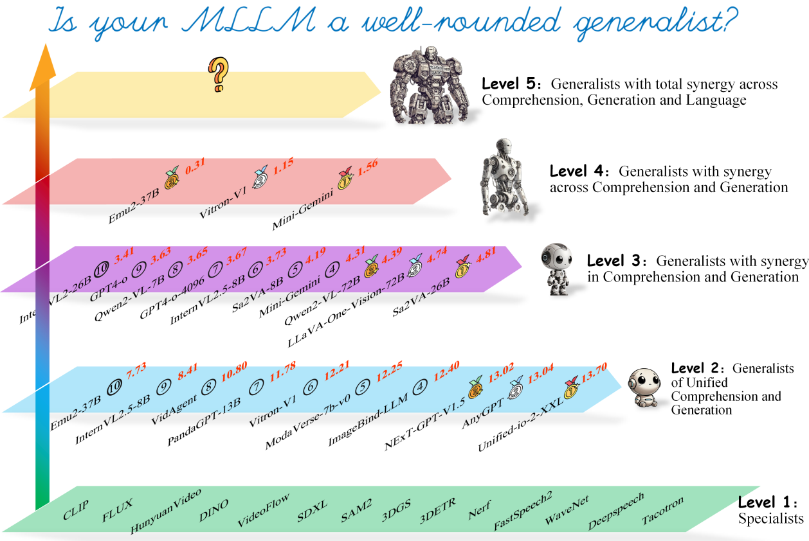

  
[On Path to Multimodal Generalist: General-Level and General-Bench](https://arxiv.org/pdf/2505.04620)

Hao Fei, Yuan Zhou, Juncheng Li, Xiangtai Li, ..., **Meng Luo**, Jiebo Luo, Tat‑Seng Chua, Hanwang Zhang, Shuicheng Yan

[**Project**](https://generalist.top/) | <strong>ICML (Spotlight)</strong>

ICML
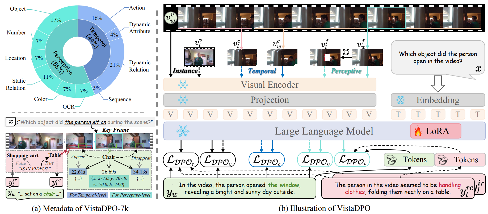

  
[VistaDPO: Video Hierarchical Spatial-Temporal Direct Preference Optimization for Large Video Models](https://arxiv.org/pdf/2504.13122)

Haojian Huang, Haodong Chen, Shengqiong Wu, **Meng Luo**, Jinlan Fu, Xinya Du, Hanwang Zhang, Hao Fei

[**Project**](https://github.com/HaroldChen19/VistaDPO) | <strong>ICML</strong>

ACL
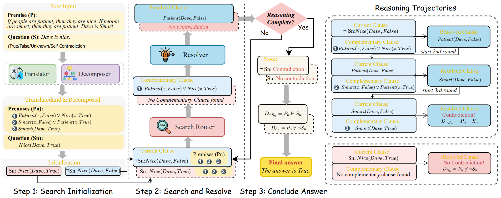

  
[Aristotle: Mastering Logical Reasoning with A Logic-Complete Decompose-Search-Resolve Framework](https://arxiv.org/pdf/2412.16953)

Jundong Xu, Hao Fei, **Meng Luo**, Qian Liu, Liangming Pan, William Yang Wang, Preslav Nakov, Mong-Li Lee, Wynne Hsu

[**Project**](https://github.com/Aiden0526/Aristotle) | <strong>ACL</strong>

- 🎓During My Master's Research Program

ACM MM
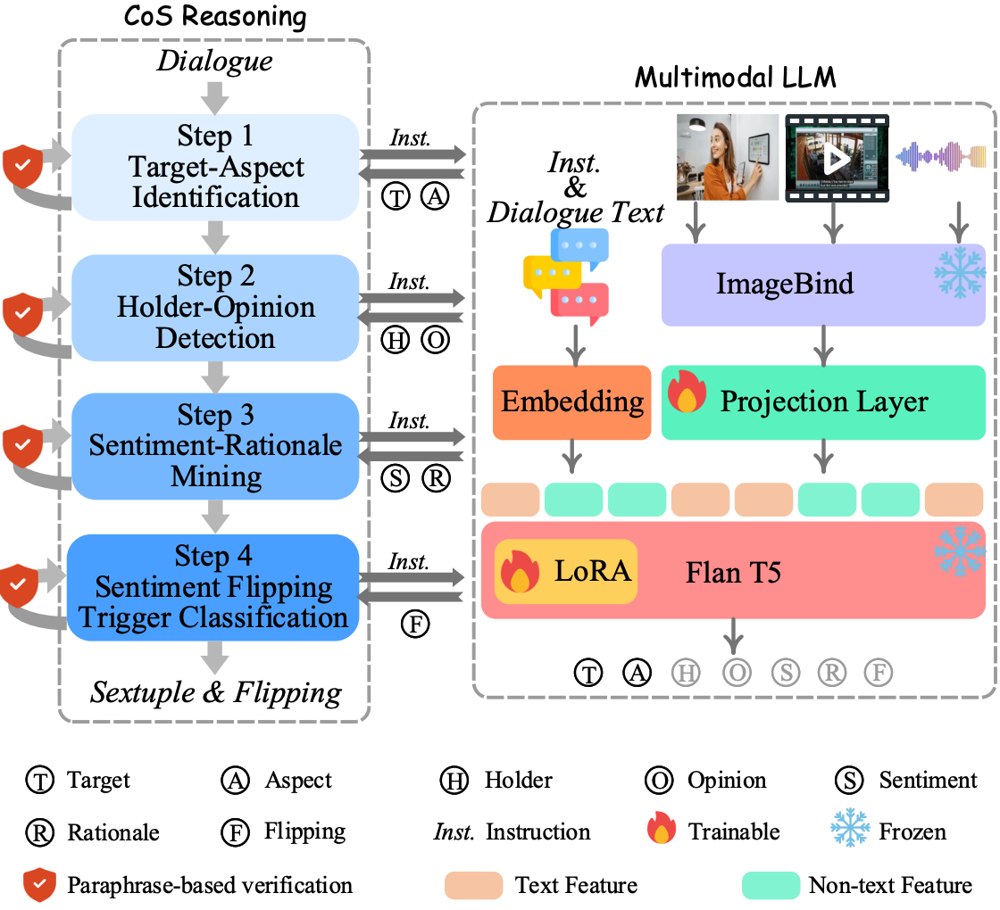

    
[PanoSent: A Panoptic Sextuple Extraction Benchmark for Multimodal Conversational Aspect-based Sentiment Analysis](https://www.arxiv.org/pdf/2408.09481)

**Meng Luo**, Hao Fei, Bobo Li, Shengqiong Wu, Qian Liu, Soujanya Poria, Erik Cambria, Mong-Li Lee, Wynne Hsu

[**Project**](https://panosent.github.io/) | <strong>ACM MM (Oral)</strong>

ICML
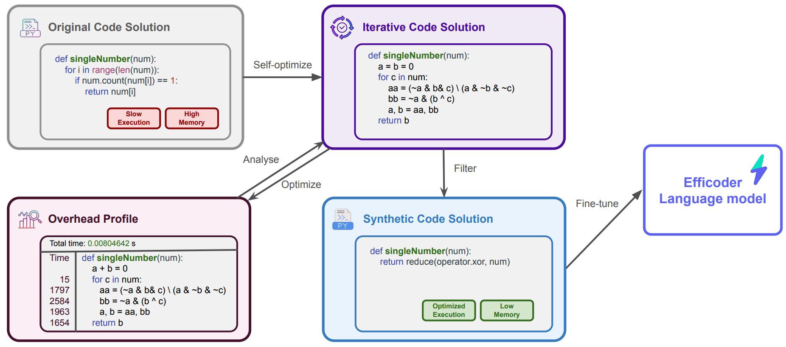

  
[SWIFTCODE: Enhancing Code Generation in Large Language Models through Efficiency-Aware Fine-tuning](https://arxiv.org/pdf/2410.10209v1)

Dong Huang, Guangtao Zeng, Jianbo Dai, **Meng Luo**, Han Weng, Yuhao Qing, Heming Cui, Zhijiang Guo, Jie M. Zhang

[**Project**](https://arxiv.org/pdf/2410.10209v1) | <strong>ICML</strong>

ICLR
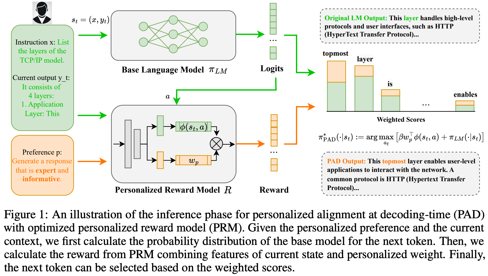

  
[PAD: Personalized Alignment at Decoding-Time](https://arxiv.org/pdf/2410.04070)

Ruizhe Chen, Xiaotian Zhang, **Meng Luo**, Wenhao Chai, Zuozhu Liu

[**Project**](https://arxiv.org/pdf/2410.04070) | <strong>ICLR</strong>

WWW
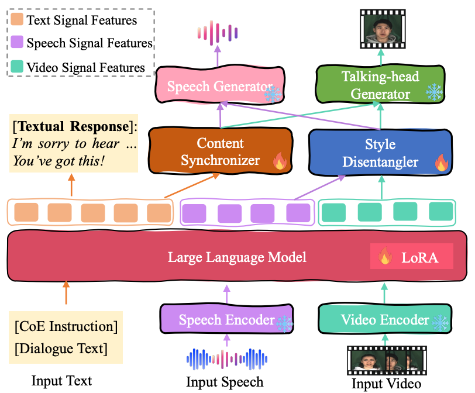

  
[Towards Multimodal Empathetic Response Generation: A Rich Text-Speech-Vision Avatar-based Benchmark](https://openreview.net/pdf?id=36Qk76s74U)

Han Zhang, Zixiang Meng, **Meng Luo**, Hong Han, Lizi Liao, Erik Cambria, Hao Fei

[**Project**](https://openreview.net/pdf?id=36Qk76s74U) | <strong>WWW</strong>

SemEval
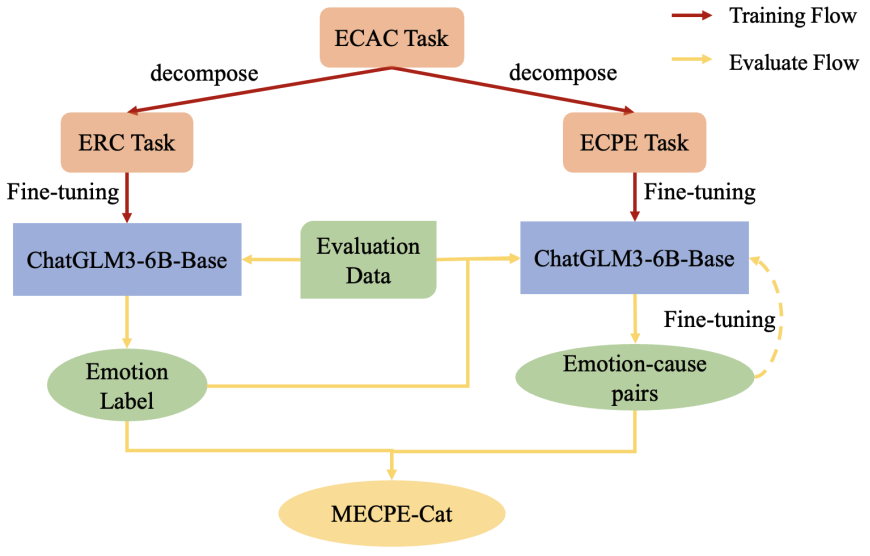

  
[NUS-Emo at SemEval-2024 Task 3: Instruction-Tuning LLM for Multimodal Emotion-Cause Analysis in Conversations](https://www.researchgate.net/profile/Hao-Fei-2/publication/380361877_NUS-Emo_at_SemEval-2024_Task_3_Instruction-Tuning_LLM_for_Multimodal_Emotion-Cause_Analysis_in_Conversations/links/6638a9cf08aa54017ae02fa0/NUS-Emo-at-SemEval-2024-Task-3-Instruction-Tuning-LLM-for-Multimodal-Emotion-Cause-Analysis-in-Conversations.pdf)

**Meng Luo**, Han Zhang, Shengqiong Wu, Bobo Li, Hong Han, Hao Fei

[**Project**](https://www.researchgate.net/profile/Hao-Fei-2/publication/380361877_NUS-Emo_at_SemEval-2024_Task_3_Instruction-Tuning_LLM_for_Multimodal_Emotion-Cause_Analysis_in_Conversations/links/6638a9cf08aa54017ae02fa0/NUS-Emo-at-SemEval-2024-Task-3-Instruction-Tuning-LLM-for-Multimodal-Emotion-Cause-Analysis-in-Conversations.pdf) | <strong> SemEval@ACL (Challenge, 2nd Place) 2024</strong>

MM Workshop
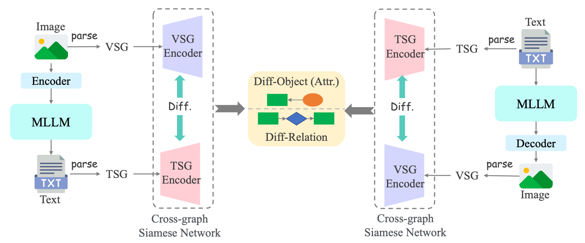

  
[Fine-grained Structural Hallucination Detection for Unified Visual Comprehension and Generation in Multimodal LLM](https://dl.acm.org/doi/pdf/10.1145/3689090.3689388)

Hao Fei, **Meng Luo**, Jundong Xu, Shengqiong Wu, Wei Ji, Mong-Li Lee, Wynne Hsu

[**Project**](https://dl.acm.org/doi/pdf/10.1145/3689090.3689388) | <strong>Workshop@MM</strong>

TDSC
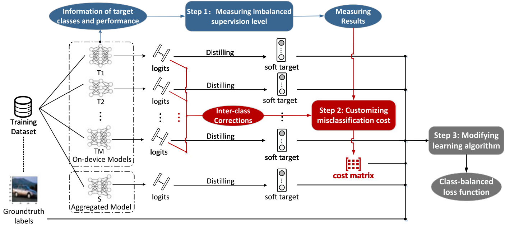

  
[Towards Class-Balanced Privacy Preserving Heterogeneous Model Aggregation](https://ieeexplore.ieee.org/abstract/document/9796594/)

Xiaoyi Pang, Zhibo Wang, Zeqing He, Peng Sun, **Meng Luo**, Ju Ren

[**Project**](https://ieeexplore.ieee.org/abstract/document/9796594/) | <strong>TDSC</strong>

arxiv
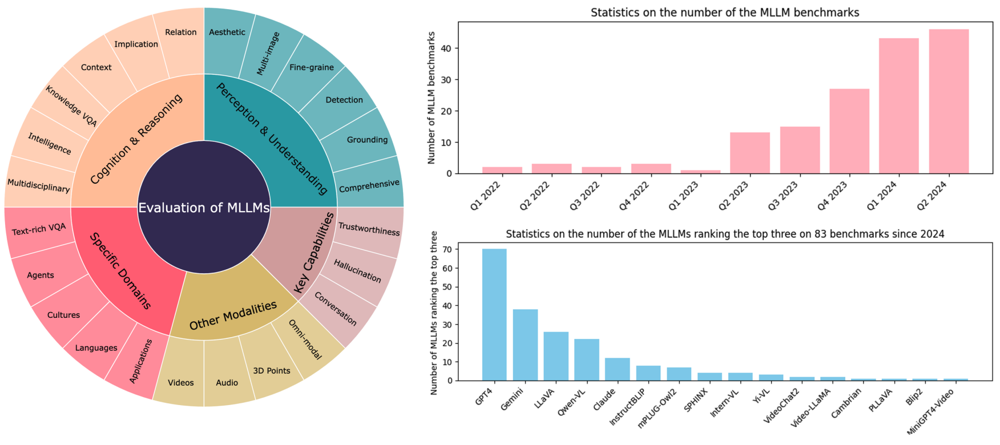

  
[A Survey on Benchmarks of Multimodal Large Language Models](https://arxiv.org/abs/2408.08632)

Jian Li, Weiheng Lu, Hao Fei, **Meng Luo**, Ming Dai, Min Xia, Yizhang Jin, Zhenye Gan, Ding Qi, Chaoyou Fu, Ying Tai, Wankou Yang, Yabiao Wang, Chengjie Wang

[**Project**](https://arxiv.org/abs/2408.08632) | <strong>arxiv</strong>

# 💻 Professional Activity
Reviewer for NeurIPS, ICLR, ICML, ICCV, ACL, ACM MM, WWW, Neurocomputing, TOMM, TALLIP.

# 🎖 Honors and Awards
### **During Undergraduate**

#### **Academic Achievements**
- 2022: Huawei Scholarship, Wuhan University (Top 5%)
- 2021: First-class Excellence Scholarship, Wuhan University (Ranked 2nd)
- 2021: Merit Student, Wuhan University (Top 10%)
- 2021: Outstanding Student, Wuhan University
  
#### **Competitions and Recognitions**
- 2022: Silver Award, Hubei Challenge Cup, Wuhan University
- 2022: Gold Award, Ziqiang Cup College, Wuhan University
- 2021: National First Prize, Citi Cup Financial Innovation Application Contest
- 2021: Bole Award, ByteTop Summit Project, ByteDance
- 2019: Top 10 Book Ambassador, Wuhan University Library
- 2018: The First Prize, HP Dream Factory Innovation Hackathon Wuhan Station, HP

#### **Leadership and Social Activities**
- 2021: Chairman, Wuhan University Campus Ambassador, ByteDance
- 2021: Excellent Campus Ambassador, WePie Team
- 2021: Online Course on Interdisciplinary Communication, University of Cambridge

------

  <i> Wisdom begins in wonder.   网罗天下，广结同盟。</i>

