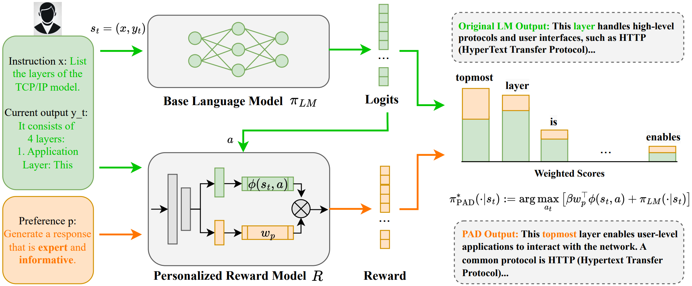








# Welcome! 
I am now an incoming PhD student at School of Computing in **National University of Singapore**. Fortunately, I will be supervised by Prof. Mong Li Lee, Prof. Wynne Hsu and Dr. Hao Fei at Center for Trusted Internet and Community (CTIC). Prior to that, I received my master degree from **NUS** and bachelor degree from **Wuhan University**.

My research interest includes **Human-centered AI, Vision and Language, Multimodal Large Language Model.**

I am currently exploring new collaboration opportunities, if you are interested in the topics mentioned above, please feel free to reaching out through **mluo@u.nus.edu**

# 🔥 News
- **2024.10**: &nbsp;**New Paper Published on arxiv**  
  <u>PAD: Personalized Alignment at Decoding-Time</u>.

- **2024.09**: &nbsp;**New Paper Published on arxiv**  
  <u>A Survey on Benchmarks of Multimodal Large Language Models</u>.

- **2024.08**: &nbsp;🎉 **Accepted at ACM MM Workshop 2024 (Oral)**:  
  <u>Fine-grained Structural Hallucination Detection for Unified Visual Comprehension and Generation in Multimodal LLM</u>.

- **2024.07**: &nbsp;🎉 **Accepted at ACM MM 2024 (Oral)**:  
  <u>PanoSent: A Panoptic Sextuple Extraction Benchmark for Multimodal Conversational Aspect-based Sentiment Analysis</u>.

- **2024.03**: &nbsp;🎉 **2nd Place at SemEval-2024**:  
  <u>NUS-Emo at SemEval-2024 Task 3: Instruction-Tuning LLM for Multimodal Emotion-Cause Analysis in Conversations</u>.

- **2022.06**: &nbsp;**Accepted at TDSC**:  
  <u>Towards Class-Balanced Privacy Preserving Heterogeneous Model Aggregation</u>.
  
# 📝 Publications 
- 🎓During My Master's Research Program

ACM MM

    
[A Panoptic Sextuple Extraction Benchmark for Multimodal Conversational Aspect-based Sentiment Analysis](https://www.arxiv.org/pdf/2408.09481)

**Meng Luo**, Hao Fei, Bobo Li, Shengqiong Wu, Qian Liu, Soujanya Poria, Erik Cambria, Mong-Li Lee, Wynne Hsu

[**Project**](https://panosent.github.io/) | <strong>CCF-A Conference Paper</strong>

SemEval

  
[NUS-Emo at SemEval-2024 Task 3: Instruction-Tuning LLM for Multimodal Emotion-Cause Analysis in Conversations](https://www.researchgate.net/profile/Hao-Fei-2/publication/380361877_NUS-Emo_at_SemEval-2024_Task_3_Instruction-Tuning_LLM_for_Multimodal_Emotion-Cause_Analysis_in_Conversations/links/6638a9cf08aa54017ae02fa0/NUS-Emo-at-SemEval-2024-Task-3-Instruction-Tuning-LLM-for-Multimodal-Emotion-Cause-Analysis-in-Conversations.pdf)

**Meng Luo**, Han Zhang, Shengqiong Wu, Bobo Li, Hong Han, Hao Fei

[**Project**](https://www.researchgate.net/profile/Hao-Fei-2/publication/380361877_NUS-Emo_at_SemEval-2024_Task_3_Instruction-Tuning_LLM_for_Multimodal_Emotion-Cause_Analysis_in_Conversations/links/6638a9cf08aa54017ae02fa0/NUS-Emo-at-SemEval-2024-Task-3-Instruction-Tuning-LLM-for-Multimodal-Emotion-Cause-Analysis-in-Conversations.pdf) | <strong> SemEval@ACL (Challenge, 2nd Place) 2024</strong>

TDSC

  
[Towards Class-Balanced Privacy Preserving Heterogeneous Model Aggregation](https://ieeexplore.ieee.org/abstract/document/9796594/)

Xiaoyi Pang, Zhibo Wang, Zeqing He, Peng Sun, **Meng Luo**, Ju Ren

[**Project**](https://ieeexplore.ieee.org/abstract/document/9796594/) | <strong>CCF-A Journal Paper</strong>

arxiv

  
[A Survey on Benchmarks of Multimodal Large Language Models](https://arxiv.org/abs/2408.08632)

Jian Li, Weiheng Lu, Hao Fei, **Meng Luo**, Ming Dai, Min Xia, Yizhang Jin, Zhenye Gan, Ding Qi, Chaoyou Fu, Ying Tai, Wankou Yang, Yabiao Wang, Chengjie Wang

[**Project**](https://arxiv.org/abs/2408.08632) | <strong>arxiv</strong>

arxiv

  
[PAD: PERSONALIZED ALIGNMENT AT DECODING-TIME](https://arxiv.org/pdf/2410.04070)

Ruizhe Chen, Xiaotian Zhang, **Meng Luo**, Wenhao Chai, Zuozhu Liu

[**Project**](https://arxiv.org/pdf/2410.04070) | <strong>arxiv</strong>

# 💻 Professional Activity
Reviewer for ICLR, ACM MM, Neurocomputing, TOMM, TALLIP.

# 🎖 Honors and Awards
- *2023.06* xxxxx (Top 5%)

# 💻 Experience

------

  <i> 怎么先炽热的却先变冷了，慢热的却停不了还在沸腾着 </i>

